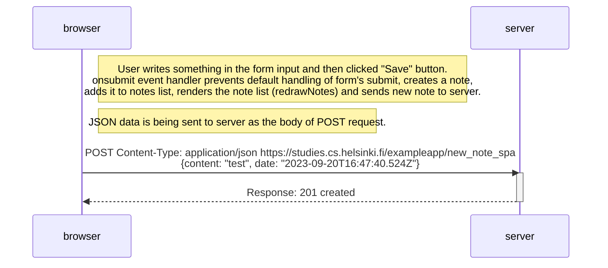

```mermaid
sequenceDiagram
participant browser
participant server

    Note right of browser: User writes something in the form input and then clicked "Save" button.  <br/> onsubmit event handler prevents default handling of form's submit, creates a note, <br/> adds it to notes list, renders the note list (redrawNotes) and sends new note to server.
    Note right of browser: JSON data is being sent to server as the body of POST request.
    browser->>server: POST Content-Type: application/json https://studies.cs.helsinki.fi/exampleapp/new_note_spa <br/> {content: "test", date: "2023-09-20T16:47:40.524Z"}
    activate server
    server-->>browser: Response: 201 created
    deactivate server
```
